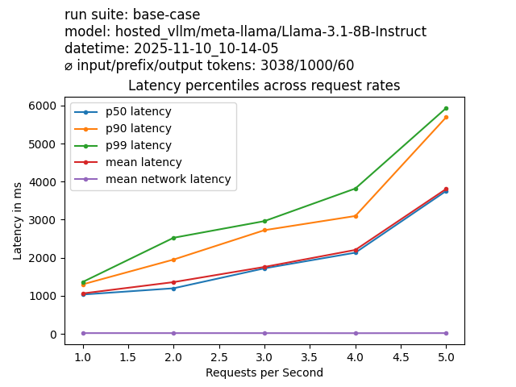
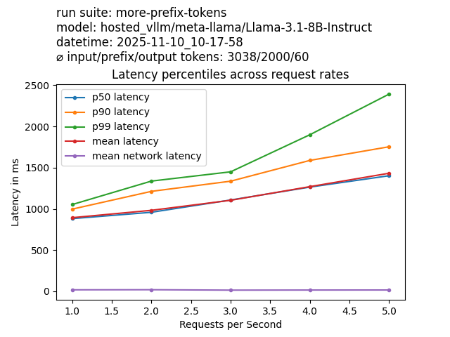
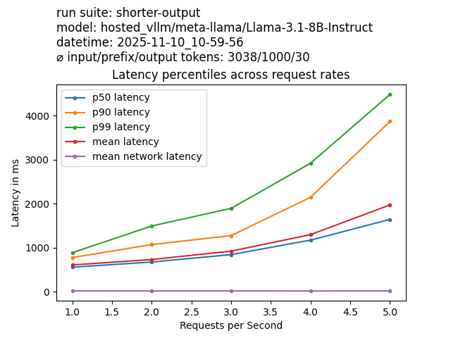
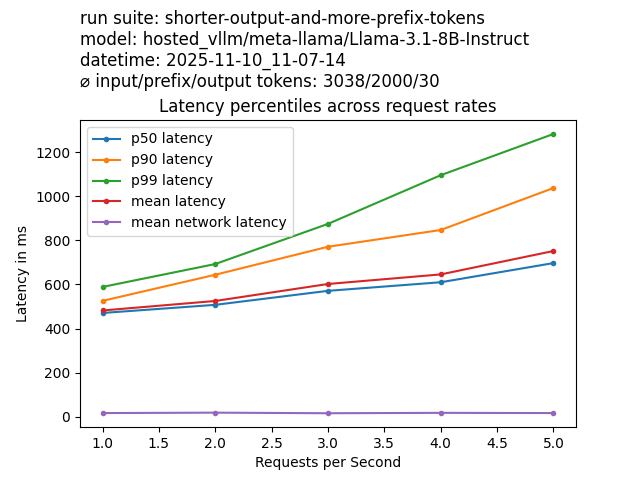

# Tokenflood

Tokenflood is a load testing tool for instruction-tuned LLMs that allows you to 
run arbitrary load profiles without needing specific prompt and response data.
**Define desired prompt lengths, prefix lengths, output lengths, and request rates, 
and tokenflood simulates this workload for you.** 

Tokenflood makes it easy to explore how latency changes when using different providers, 
hardware, quantizations, or prompt and output lengths.

Tokenflood uses [litellm](https://www.litellm.ai/) under the hood and supports 
[all providers that litellm covers](https://docs.litellm.ai/docs/providers).

> [!CAUTION]
> Tokenflood can generate high costs if configured poorly and used with pay-per- 
> token services. Make sure you only test workloads that are within a reasonable budget.
> See the safety section for more information.

### Table of Contents

* [Common Usage Scenarios](#common-usage-scenarios)
  * [Example: Assessing the effects of prompt optimizations](#example-assessing-the-effects-of-prompt-optimizations-)
* [Professional Services](#-professional-services-)
* [Installation](#installation)
* [Quick Start](#quick-start)
* [Endpoint Specifications](#endpoint-specs)
  * [Endpoint Examples](#endpoint-examples)
* [Run Suites](#run-suites)
* [Heuristic Load Testing Explained](#heuristic-load-testing)
* [Safety](#-safety-)

## Common Usage Scenarios

1. Load testing self-hosted LLMs.
2. Assessing the effects of hardware, quantization, and prompt optimizations on latency, throughput, and costs.
3. Assessing the intraday latency variations of hosted LLM providers for your load types.
4. Assessing and choosing a hosted LLM provider before going into production with them. 

### Example: Assessing the effects of prompt optimizations upfront
Here is an example of exploring the effects of prompt parameters for latency and throughput.
The following graphs depict different load scenarios. Together they show the impact of hypothetical improvements to the prompt parameters.

The first graph represents the base case, our current prompt parameters: ~3000 input tokens, of which ~1000 are a common prefix that can be cached, and ~60 output tokens.



In the graphs, you can see the mean latency, and the 50th, 90th and 99th percentile latency. 
These percentile lines indicate the latency below which 50%, 90%, and 99% of LLM requests came in.
When designing latency sensitive systems, it's important to have an understanding of the distribution and 
not just the average. At 3 requests per second, our system gives us a latency of around
1720ms for the 50th percentile, 2700ms for the 90th percentile, and 2950ms for the 99th percentile.
That means 50% of requests came back in under 1720ms, 90% below 2700ms and 99% of requests
came back below 2950ms.

Let's say in our hypothetical prompt, we could rearrange things a little bit to increase
the number of tokens in the beginning that are always the same and thus increase the prefix-cached part.
We might have to invest some additional time into prompt tuning again if we change things, so
we would like to know how much such a change would improve latency. 

Let's run the test by increasing the number of prefix tokens from 1000 to 2000:



We see a meaningful improvement going down to around 1100ms for the 50th percentile,
down to 1340ms for the 90th percentile, and down to 1450ms for the 99th percentile at 3 requests per second.

Another option to cut down latency could be to reduce the number of output tokens. Maybe
our current hypothetical prompt uses JSON output which is very verbose and needs a lot of tokens for 
all the special characters. It might have more expressiveness than your task really requires,
so how about checking the pay-off from using a shorter output format before implementing the
changes?

Let's start from the base case again and reduce the number of output tokens from 60 to 30:



We again see a good improvement here, going down to 840ms for the 50th, to 1270ms for the 90th, 
and to 1900 ms for the 99th percentile at 3 requests per second.

Finally, we might wonder to what extend both improvements add up or whether having one of them gets you
all the benefit there is to have. So we apply both changes, increasing the number of prefix tokens to 2000 and reducing the
number of output tokens to 30.



Indeed, they add up noticeably in our setup having dedicated and limited compute. We reach
a 50th percentile latency of 570ms, 90th percentile with 770ms, and 99th percentile with 870ms.

Here's a brief extract of the data in tabular form:

| Scenario           | #Input Tokens | #Prefix Tokens | #Output Tokens | #50th percentile latency (@3req/s) | #90th percentile latency (@3req/s) | #99th percentile latency (@3req/s) | 
|--------------------|---------------|----------------|----------------|------------------------------------|------------------------------------|------------------------------------|
| base case          | 3038          | 1000           | 60             | 1720ms                             | 2700ms                             | 2950ms                             |
| more prefix tokens | 3038          | 2000           | 60             | 1100ms                             | 1340ms                             | 1450ms                             |
| shorter output     | 3038          | 1000           | 30             | 840ms                              | 1270ms                             | 1900ms                             |
| both changes       | 3038          | 2000           | 30             | 570ms                              | 770ms                              | 870ms                              |

## 🛠️ Professional Services 🛠️

If you are looking for paid professional support to
* optimize your LLM accuracy, latency, throughput, or costs
* fine-tune open models for your use case, 
* designing and building custom AI systems

feel free to reach out to me at thomas@werkmeister.me or on [linkedin](https://www.linkedin.com/in/twerkmeister/).

## Installation

```bash
pip install tokenflood
```

## Quick Start

For a quick start, make sure that vllm is installed, and you serve a small model:
```bash
pip install vllm
vllm serve HuggingFaceTB/SmolLM-135M-Instruct
```

Afterward, create the basic config files and do a first run:
```bash
# This creates config files for a tiny first run: run.yml and endpoint.yml
tokenflood init
# Afterwards you can inspect those files and run them
tokenflood run run_suite.yml endpoint.yml
```

Finally, in the `results` folder you should find your run folder
containing:
* a graph visualizing the latency quantiles across the difference request rates and the network latency (`latency_quantiles.png`)
* the raw data points collected from the LLM calls (`llm_requests.csv`)
* the raw data points collected from assessing network latency (`network_latency.csv`)
* a summary file containing lots of information about the run (`summary.yml`)
* the original run suite config used for the run (`run_suite.yml`)
* the original endpoint config used for the run (`endpoint_spec.yml`)
* an error log (`errors.csv`)

## Endpoint Specs

With the endpoint spec file you can determine the target of the load test. 
Tokenflood uses [litellm](https://www.litellm.ai/) under the hood and supports 
[all providers that litellm covers](https://docs.litellm.ai/docs/providers).

Here you see the example endpoint spec file from the quick start: 
```yaml
provider: hosted_vllm
model: HuggingFaceTB/SmolLM-135M-Instruct
base_url: http://127.0.0.1:8000/v1
api_key_env_var: null
deployment: null
extra_headers: {}
```
Explanation of the parameters:
* `provider`: is the provider parameter used by litellm and is used to determine how to exactly interact with the endpoint as different providers have different APIs.
* `model`: the specific model to use at the given endpoint.
* `base_url`: important if you are self-hosting or using an endpoint in a specific region of a provider.
* `api_key_env_var`: The name of the environment variable to use as the API key. If you specify it, it allows you to manage multiple API keys for the same provider for different regions without changing env files: such as `AZURE_KEY_FRANKFURT` and `AZURE_KEY_LONDON`.
* `deployment`: Required for some providers such as azure.
* `extra_headers`: Can be useful for certain providers to select models.

Tokenflood passes all these parameters right through to litellm's completion call. 
To get a better understanding, it's best to have a look at [the official documentation of the litellm completion call](https://docs.litellm.ai/docs/completion/input). 

### Endpoint Examples

#### Self-hosted VLLM

```yaml
provider: hosted_vllm
model: meta-llama/Llama-3.1-8B-Instruct
base_url: http://127.0.0.1:8000/v1
```

#### Openai

```yaml
provider: openai
model: gpt-4o-mini
```
Env vars: `OPENAI_API_KEY`

#### Bedrock
```yaml
provider: bedrock
model: anthropic.claude-3-sonnet-20240229-v1:0
```
Env vars: `AWS_ACCESS_KEY_ID`, `AWS_SECRET_ACCESS_KEY`, `AWS_REGION_NAME`

#### AWS Sagemaker Inference Endpoints
```yaml
provider: sagemaker_chat
model: your-sagemaker-endpoint
```
Env vars: `AWS_ACCESS_KEY_ID`, `AWS_SECRET_ACCESS_KEY`, `AWS_REGION_NAME`

#### Azure

```yaml
provider: azure
deployment: gpt-4o
model: gpt-4o
api_version: 2024-06-01
api_base: https://my-azure-url.openai.azure.com/
```

Env vars: `AZURE_API_KEY`

#### Gemini

```yaml
provider: gemini
model: gemini-2.5-flash-lite-preview-09-2025
```

Env vars: `GEMINI_API_KEY`

#### Anthropic
```yaml
provider: anthropic
model: claude-3-5-sonnet-20240620
```

Env vars: `ANTHROPIC_API_KEY`

## Run Suites

With a run suite you define the specific test you want to run. Each test can have multiple
phases with a different number of requests per second. All phases share the same length in 
seconds and the type of loads that are being sent.

Here is the run suite that is being created for you upon calling `tokenflood init`:
```yaml
name: ripple
requests_per_second_rates:  # Defines the phases with the different request rates
- 1.0
- 2.0
test_length_in_seconds: 10  # each phase is 10 seconds long
load_types:                 # This run suite has two load types with equal weight
- prompt_length: 512        # prompt length in tokens
  prefix_length: 128        # prompt prefix length in tokens
  output_length: 32         # output length in tokens
  weight: 1                 # sampling weight for this load type
- prompt_length: 640
  prefix_length: 568
  output_length: 12
  weight: 1
percentiles:                # the latency percentiles to report
- 50
- 90
- 99
input_token_budget: 100000  # the maximum number of input tokens this test is allowed to use - prevents any load configuration that would use more than this from starting
output_token_budget: 10000  # the maximum number of output tokens this test is allowed to use - prevents any load configuration that would use more than this from starting
```

## Heuristic Load Testing

Tokenflood does not need specific prompt data to run tests. Instead, it only needs
metadata about the prompt and task: prompt length, prefix length, and output lengths. 
All counted in tokens. This allows for swift testing of alternative configurations and 
loads. Changing the token counts in the load types is a matter of seconds as opposed 
to having to adjust implementations and reobserving prompts of a system. Additionally, 
you can make sure to get exactly the desired output profile across all models and 
configurations, allowing for direct comparison between them.

### How it works

Tokenflood uses sets of strings that correspond to a single token in most tokenizers,
such as a space plus a capital letter. Sampling from this set of single token strings, 
tokenflood generates the input prompt. The defined prefix length will be non-random.
Finally, a task that usually generates a long answer is appended. In combination with
setting the maximum completion tokens for generation, tokenflood achieves the desired
output length.

### Why it works

This type of heuristic testing creates reliable data because the processing time of a
non-reasoning LLM only depends on the length of input and output and any involved caching 
mechanisms.

### Failures of the heuristic

Heuristic load testing comes with the risk of not perfectly achieving the desired token 
counts for specific models. If that happens, tokenflood will warn you during a run if 
any request diverges more than 10% from the expected input or output token lengths. At 
the end of a run, you will also be warned about the average divergence if it is more 
than 10% from the expected token count. In the summary file of a run, you can see the 
absolute and relative divergences again.

> [!IMPORTANT]
> You can specify the prefix length, however, whether the prefix is used will depend on the 
> specific endpoint and its configuration. Some providers, like OpenAI, will only start to
> use prefix caching once your total prompt length exceeds 1024 tokens. Additionally,
> it seems litellm does not always record the usage of prefix caching. When
> using vllm as the inference server, it never reports any cached tokens. At the same 
> time, one can see a big difference in latency between using and not using prefix 
> caching despite the cached tokens not being reported properly. Due to this issue,
> tokenflood currently does not warn when the desired prefix tokens diverge from the 
> measured ones.


## 🚨 Safety 🚨

Using tokenflood can result in high token spending. To prevent negative surprises,
tokenflood has additional safety measurements:

1. Tokenflood always tries to estimate the used tokens for the test upfront and asks you to confirm the start of the tests after seeing the estimation.
2. There are additional run suite variables that determine the maximum allowed input and output token budget for the test. A test whose token usage estimate exceeds those limits will not be started.
3. Tokenflood won't start a run were the first warm-up request fails, e.g., due to API key misconfiguration
4. Tokenflood will end a run once the error rate exceeds 30% for the last 30 requests.

Still, these measures do not provide perfect protection against misconfiguration. 
Always be careful when using tokenflood.
