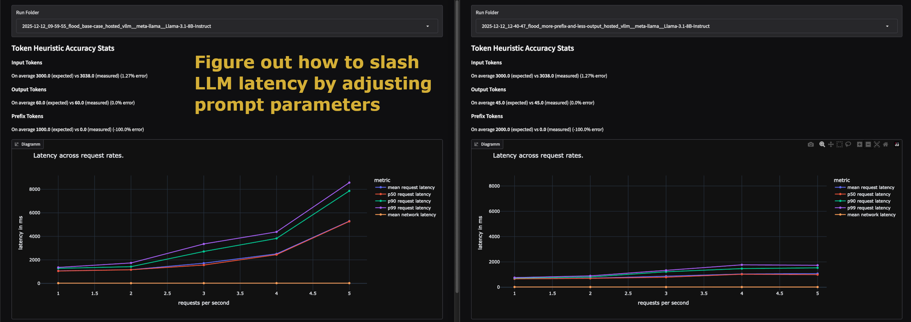

# Tokenflood

Tokenflood is a load testing tool for instruction-tuned LLMs that allows you to 
run arbitrary load profiles without needing specific prompt and response data.
**Define desired prompt lengths, prefix lengths, output lengths, and request rates, 
and tokenflood simulates this workload for you.** 

Tokenflood makes it easy to explore how latency changes when using different providers, 
hardware, quantizations, or prompt and output lengths.

Tokenflood uses [litellm](https://www.litellm.ai/) under the hood and supports 
[all providers that litellm covers](https://docs.litellm.ai/docs/providers).

> [!CAUTION]
> Tokenflood can generate high costs if configured poorly and used with pay-per- 
> token services. Make sure you only test workloads that are within a reasonable budget.
> See the safety section for more information.

### Table of Contents

* [Common Usage Scenarios](#common-usage-scenarios)
  * [Example: Assessing the effects of prompt optimizations](#example-assessing-the-effects-of-prompt-optimizations-)
* [Professional Services](#-professional-services-)
* [Installation](#installation)
* [Quick Start](#quick-start)
* [Endpoint Specifications](#endpoint-specs)
  * [Endpoint Examples](#endpoint-examples)
* [Run Suites](#run-suites)
* [Heuristic Load Testing Explained](#heuristic-load-testing)
* [Safety](#-safety-)

## Common Usage Scenarios

1. Load testing self-hosted LLMs.
2. Assessing the effects of hardware, quantization, and prompt optimizations on latency, throughput, and costs.
3. Assessing the intraday latency variations of hosted LLM providers for your load types.
4. Assessing and choosing a hosted LLM provider before going into production with them. 

### Example 1: Assessing the effects of potential prompt optimizations



The left graph represents the base case, our current prompt parameters: ~3000 input tokens, of which ~1000 are a common prefix that can be cached, and ~60 output tokens.

The right graph represents a hypothetical improvement to prompt parameters: the same 3000 input tokens, but now 2000 common prefix tokens achieved by rearranging or standardizing parts, and a reduction to 45 output tokens.
 
The result is a more than 50% reduction in latency while at the same time meaningfully increasing amount of prompts that can be served on the same hardware without latency going through the roof.

Tokenflood allows you to find worthwhile goals for prompt parameter improvements before going there.

### Example 2: Observing the West Coast effect

Load testing large providers does not really make sense if you value your money as their datacenters are huge, shared resources. While a single company or user usually does not have much effect on them,
these shared resources are subject to intra-day latency variations, oftentimes coinciding with daily business hours.

[!observing-intraday-latency-variation](./images/observe.png)

Here we see that once business starts on the West Coast the latency of this openai model drops by 500-1000ms for our chosen prompt parameters. 

Tokenflood allows you to assess these patterns before going into production with a vendor. 

## 🛠️ Professional Services 🛠️

If you are looking for professional support to
* optimize your LLM accuracy, latency, throughput, or costs
* fine-tune open models for your use case
* improve your LLM observability
* design and build custom AI systems

feel free to reach out to me at thomas@werkmeister.me or on [linkedin](https://www.linkedin.com/in/twerkmeister/).

## Installation

```bash
pip install tokenflood
```

## Quick Start

For a quick start, make sure that vllm is installed, and you serve a small model:
```bash
pip install vllm
vllm serve HuggingFaceTB/SmolLM-135M-Instruct
```

Afterward, create the basic config files and do a first run:
```bash
# This creates tiny starter files: run_suite.yml, observation_spec.yml and endpoint_spec.yml
tokenflood init
# Afterwards you can inspect those files, and then do a load test
tokenflood run run_suite.yml endpoint_spec.yml
# Or observe the endpoint
tokenflood observe observation_spec.yml endpoint_spec.yml
# start the data visualisation frontend
tokenflood viz
``` 

## Configuration

### Endpoint Specs

With the endpoint spec file you can determine the target of the load test. 
Tokenflood uses [litellm](https://www.litellm.ai/) under the hood and supports 
[all providers that litellm covers](https://docs.litellm.ai/docs/providers).

Here you see the example endpoint spec file from the quick start: 
```yaml
provider: hosted_vllm
model: HuggingFaceTB/SmolLM-135M-Instruct
base_url: http://127.0.0.1:8000/v1
api_key_env_var: null
deployment: null
extra_headers: {}
```
Explanation of the parameters:
* `provider`: is the provider parameter used by litellm and is used to determine how to exactly interact with the endpoint as different providers have different APIs.
* `model`: the specific model to use at the given endpoint.
* `base_url`: important if you are self-hosting or using an endpoint in a specific region of a provider.
* `api_key_env_var`: The name of the environment variable to use as the API key. If you specify it, it allows you to manage multiple API keys for the same provider for different regions without changing env files: such as `AZURE_KEY_FRANKFURT` and `AZURE_KEY_LONDON`.
* `deployment`: Required for some providers such as azure.
* `extra_headers`: Can be useful for certain providers to select models.

Tokenflood passes all these parameters right through to litellm's completion call. 
To get a better understanding, it's best to have a look at [the official documentation of the litellm completion call](https://docs.litellm.ai/docs/completion/input). 

#### Endpoint Examples

##### Self-hosted VLLM

```yaml
provider: hosted_vllm
model: meta-llama/Llama-3.1-8B-Instruct
base_url: http://127.0.0.1:8000/v1
```

##### Openai

```yaml
provider: openai
model: gpt-4o-mini
```
Env vars: `OPENAI_API_KEY`

##### Bedrock
```yaml
provider: bedrock
model: anthropic.claude-3-sonnet-20240229-v1:0
```
Env vars: `AWS_ACCESS_KEY_ID`, `AWS_SECRET_ACCESS_KEY`, `AWS_REGION_NAME`

##### AWS Sagemaker Inference Endpoints
```yaml
provider: sagemaker_chat
model: your-sagemaker-endpoint
```
Env vars: `AWS_ACCESS_KEY_ID`, `AWS_SECRET_ACCESS_KEY`, `AWS_REGION_NAME`

##### Azure

```yaml
provider: azure
deployment: gpt-4o
model: gpt-4o
api_version: 2024-06-01
api_base: https://my-azure-url.openai.azure.com/
```

Env vars: `AZURE_API_KEY`

##### Gemini

```yaml
provider: gemini
model: gemini-2.5-flash-lite-preview-09-2025
```

Env vars: `GEMINI_API_KEY`

##### Anthropic
```yaml
provider: anthropic
model: claude-3-5-sonnet-20240620
```

Env vars: `ANTHROPIC_API_KEY`

### Run Suites

With a run suite you define a load test that you want to run. Each test can have multiple
phases with a different number of requests per second. All phases share the same length in 
seconds and the type of loads that are being sent.

Here is the run suite that is being created for you upon calling `tokenflood init`:
```yaml
name: starter
requests_per_second_rates:  # Defines the phases with the different request rates
- 1.0
- 2.0
test_length_in_seconds: 10  # each phase is 10 seconds long
load_types:                 # This run suite has two load types with equal weight
- prompt_length: 512        # prompt length in tokens
  prefix_length: 128        # prompt prefix length in tokens
  output_length: 32         # output length in tokens
  weight: 1                 # sampling weight for this load type
- prompt_length: 640
  prefix_length: 568
  output_length: 12
  weight: 1
percentiles:                # the latency percentiles to report
- 50
- 90
- 99
budget:
  input_tokens: 100000      # the maximum number of input tokens this test is allowed to use - prevents any load configuration that would use more than this from starting
  output_tokens: 10000      # the maximum number of output tokens this test is allowed to use - prevents any load configuration that would use more than this from starting
error_limit: 0.3            # the fraction of errors in requests that are acceptable for the last 30 requests. The test will end once this limit is breached.
task:                       # The task tokenflood uses to generate a lot of tokens which we can truncate using the max token parameters - makes sure we do not produce too few tokens!
  task: 'Task: Count up to 1000 naming each individual number like this: 1 2 3 4'
token_set:                  # The 1-token strings tokenflood uses to fill up the prompt and prefix up to the desired length   
  tokens:
  - ' A'
  - ' B'
  - ' C'
  - ' D'
  - ' E'
  - ' F'
  - ' G'
  - ' H'
  - ' I'
  - ' J'
  - ' K'
  - ' L'
  - ' M'
  - ' N'
  - ' O'
  - ' P'
  - ' Q'
  - ' R'
  - ' S'
  - ' T'
  - ' U'
  - ' V'
  - ' W'
  - ' X'
  - ' Y'
  - ' Z'

```

### Observation Specs

With an observation spec you define a longer running observation of an endpoint. 
You can define a total length of your observation in hours and a polling interval 
in minutes as well as how many and what type of requests you want to send at those 
points in time.

Here is the observation spec that is generated by running `tokenflood init`:

```yaml
name: starter
duration_hours: 1.0             # total test length: 1 hour
polling_interval_minutes: 15.0  # send requests every 15 minutes
load_type:                      # observation runs just have one load type
  prompt_length: 512            # prompt length in tokens
  prefix_length: 128            # prompt prefix length in tokens
  output_length: 32             # output length in tokens
num_requests: 5                 # how many requests to send at the start of an interval
within_seconds: 2.0             # within how many seconds to send the requests at the start of an interval (useful to manage rate limits)
percentiles:                    # the latency percentiles to report
- 50
- 90
- 99
budget:
  input_tokens: 1000000         # the maximum number of input tokens this test is allowed to use - prevents any load configuration that would use more than this from starting
  output_tokens: 10000          # the maximum number of output tokens this test is allowed to use - prevents any load configuration that would use more than this from starting
task:                           # The task tokenflood uses to generate a lot of tokens which we can truncate using the max token parameters - makes sure we do not produce too few tokens!
  task: 'Task: Count up to 1000 naming each individual number like this: 1 2 3 4'
token_set:                      # The 1-token strings tokenflood uses to fill up the prompt and prefix up to the desired length 
  tokens:
  - ' A'
  - ' B'
  - ' C'
  - ' D'
  - ' E'
  - ' F'
  - ' G'
  - ' H'
  - ' I'
  - ' J'
  - ' K'
  - ' L'
  - ' M'
  - ' N'
  - ' O'
  - ' P'
  - ' Q'
  - ' R'
  - ' S'
  - ' T'
  - ' U'
  - ' V'
  - ' W'
  - ' X'
  - ' Y'
  - ' Z'
```


## Heuristic Load Testing

Tokenflood does not need specific prompt data to run tests. Instead, it only needs
metadata about the prompt and task: prompt length, prefix length, and output lengths. 
All counted in tokens. This allows for swift testing of alternative configurations and 
loads. Changing the token counts in the load types is a matter of seconds as opposed 
to having to adjust implementations and reobserving prompts of a system. Additionally, 
you can make sure to get exactly the desired output profile across all models and 
configurations, allowing for direct comparison between them.

### How it works

Tokenflood uses sets of strings that correspond to a single token in most tokenizers,
such as a space plus a capital letter. Sampling from this set of single token strings, 
tokenflood generates the input prompt. The defined prefix length will be non-random.
Finally, a task that usually generates a long answer is appended. In combination with
setting the maximum completion tokens for generation, tokenflood achieves the desired
output length.

### Why it works

This type of heuristic testing creates reliable data because the processing time of a
non-reasoning LLM only depends on the length of input and output and any involved caching 
mechanisms.

### Failures of the heuristic

Heuristic load testing comes with the risk of not perfectly achieving the desired token 
counts for specific models. If that happens, tokenflood will warn you during a run if 
any request diverges more than 10% from the expected input or output token lengths. The
visualisation frontend also shows absolute and relative token errors.

> [!IMPORTANT]
> You can specify the prefix length, however, whether the prefix is used will depend on the 
> specific endpoint and its configuration. Some providers, like OpenAI, will only start to
> use prefix caching once your total prompt length exceeds 1024 tokens. Additionally,
> it seems litellm does not always record the usage of prefix caching. When
> using vllm as the inference server, it never reports any cached tokens. At the same 
> time, one can see a big difference in latency between using and not using prefix 
> caching despite the cached tokens not being reported properly. Due to this issue,
> tokenflood currently does not warn when the desired prefix tokens diverge from the 
> measured ones.


## 🚨 Safety 🚨

Using tokenflood can result in high token spending. To prevent negative surprises,
tokenflood has additional safety measurements:

1. Tokenflood always tries to estimate the used tokens for the test upfront and asks you to confirm the start of the tests after seeing the estimation.
2. There are additional run suite variables that determine the maximum allowed input and output token budget for the test. A test whose token usage estimate exceeds those limits will not be started.
3. Tokenflood won't start a run were the first warm-up request fails, e.g., due to API key misconfiguration
4. Tokenflood will end a run once the error rate exceeds 30% for the last 30 requests.

Still, these measures do not provide perfect protection against misconfiguration. 
Always be careful when using tokenflood.

## 🤝 Contributing

We welcome contributions!
If you'd like to add new features, fix bugs, or improve the documentation:

1. Fork the repository

2. Install including dev dependencies
   
   ```
   poetry install --all-groups
   ```

3. Create a feature branch:

   ```
   git checkout -b feature/my-improvement
   ```

4. Make your changes and add tests if applicable

5. Run linting and tests locally to ensure everything works:

   ```
   make lint
   make test
   ```

6. Submit a pull request with a clear description of your improvement

If you plan a major change (e.g., new test type or provider integration), please open an issue first to discuss it.
